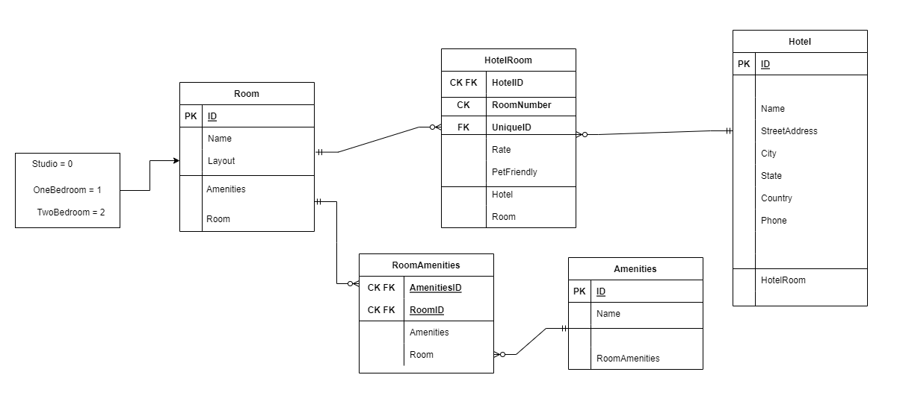

# Async-Inn
---
## Name: Osama Alzaghal.
## Date: 14-4-2022.
---

### Introduction
This web app is for a hotel management system. Users can view the hotels, rooms, and the amenities available either by retrieving all data of each table or by getting a specific one using it's ID.
### I have the following tables:
+ Room: so this room has a unique ID and other properites such as name and layout.
+ Hotel: the hotel has an ID, name, street address, city, state, country, and phone. All of these are provided in the requierments.
+ Amenities: it has an ID and a name. It navigates to RoomAmenities table since the relationship between them is a many to many.
+ RoomAmenities: It has two CK and FK; because this table is responsible of connecting both of Room and Amenities tables, and it navigates to Room and Amenities tables; because relationship between them is a many to many..
+ HotelRoom: it has An ID, CK and and FK, along with other properties such as Rate and PetFriendly. All of these were mentioned in the requierments. It navigates to Hotel and Room table; because the relationship between them is a many to many.
+ Enum for the size of Room, it could be a studio or one/two bedroom(s).
---
## Async Inn ERD

---
## Date: 21-4-2022.
---
### Update
So for Lab13, I did the following:
+ Using Dependency Injection, I refactored my Hotels, Rooms, and Amenities Controllers to depend on an interface rather than the DbContext.

+ Built an interface for each of the controllers that contain the required method signatures to all for CRUD operations to the database directly.

+ Updated each of the controllers to inject the interface rather than the DBContext.

+ Created a service for each of the controllers that implement the appropriate interface. Built out the logic to satisfy the interface by making the appropriate calls to the db for each action.

+ Updated me Controller to use the appropriate method from the interface rather than the DBContext directly.

+ Confirmed in POSTMAN that my controllers are returning the same logic as they did in Lab 12 for the CRUD operations.

### Architecture pattern
So for this project, I have interfaces and services classes  to depend on rather than the AsyncInnDbContext. I used a variable of the interface to access the methods I implemented inside my services classes, then refactored my controllers so they have a single task to do.

---
## Date: 24-4-2022.
Update: added new endpoints.

---
## Endpoints:
---
### For HotelController
+ GET: api/Hotels
+ GET: api/Hotels/{id}
+ PUT: api/Hotels/{id}
+ POST: api/Hotels/Hotel
+ DELETE: api/Hotels/{id}
---
### For AmenitiesController
+ GET: api/Amenities
+ GET: api/Amenities/5
+ PUT: api/Amenities/5
+ POST: api/Amenities
+ DELETE: api/Amenities/5
---
### For RoomController
+ GET: api/Rooms 
+ GET: api/Rooms/{id}
+ PUT: api/Rooms/{id}
+ POST: api/Rooms/Room
+ DELETE: api/Rooms/{id}
+ POST: api/Rooms/{roomId}/{amenityId}
+ DELETE: api/Rooms/{roomId}/{amenityId}
---
### For HotelRoomsController
+ GET: api/HotelRooms/{hotelId}
+ GET: api/HotelRooms/{hotelId}/{roomNumber}
+ POST: api/HotelRooms/{hotelId}/{roomId}/{roomNumber}
+ DELETE: api/HotelRooms/{hotelId}/{roomNumber}
+ PUT: api/HotelRooms/{hotelId}/{roomNumber}

---
